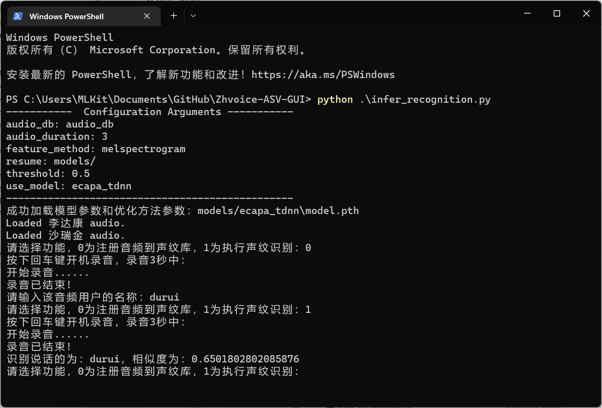

# 如何让风扇转起来
适合初学者。经测试，在VoxCeleb

# 1. 环境配置
本地测试环境：

LAPTOP: ROG Zephyrus G15

OS: Windows 11 家庭中文版 21H2

GPU: **NVIDIA** GeForce RTX 3080 Laptop GPU

<br/>
[云端](https://featurize.cn?s=cec3c4645c8c4946ba70369eb99d5529)测试环境：

CPU: 18 核 Xeon Gold 6142

GPU: 3 块 RTX 3080， 共 31.5 GB 显存

Docker: v20.10.10

CUDA: v11.2

PyTorch: v1.10

<br/>
基本依赖：

- [x] 检查清单

- [ ] 若`torch.__version__`显示`cpu`，请卸载torch并重装gpu版本。

- [ ] 若`torch.cuda.is_available()`显示`False`，请自行查阅资料安装[CUDA](https://developer.nvidia.com/cuda-downloads)和[cuDNN](https://developer.nvidia.com/rdp/cudnn-download)。


<br/>
其他依赖：

```shell
pip install -r requirements.txt -i https://mirrors.aliyun.com/pypi/simple/
```

# 2. 数据准备、模型训练与模型评估
建议先跳过这一步，直接下载`release`中提供的预训练模型；看到最终效果后，再返工训练模型。

<br/>
<br/>

首先，

- [x] 下载 [zhvoice](https://github.com/fighting41love/zhvoice) 中文语音数据集
- [x] 根目录下新建`dataset`文件夹，将数据集压缩包依次解压至该文件夹
- [ ] （选做）将加性噪声音频添加至`dataset`文件夹，相应地，修改`./config/augment.yml`
- [ ] 在终端中运行：`python .\create_data.py`，创建列表

其次，

- [ ] 在终端中运行：`python .\train.py`，训练模型
- [ ] 在终端中运行：`visualdl --logdir ./log --port 8080`，查看进展（`http://127.0.0.1:8080`）


最后，

- [ ] 在终端中运行：`python eval.py`，计算阈值

# 3. 声纹相似度量与声纹数据库
- [x] 如果你跳过了第二步，请确认是否已经将`models.zip`解压至当前工作目录。

- [x] 如果成功，`./models/ecapa_tdnn`中会存在`model.pth`文件。
- [ ] 相似度量：

- [ ] 声纹数据库注册与声纹识别：
